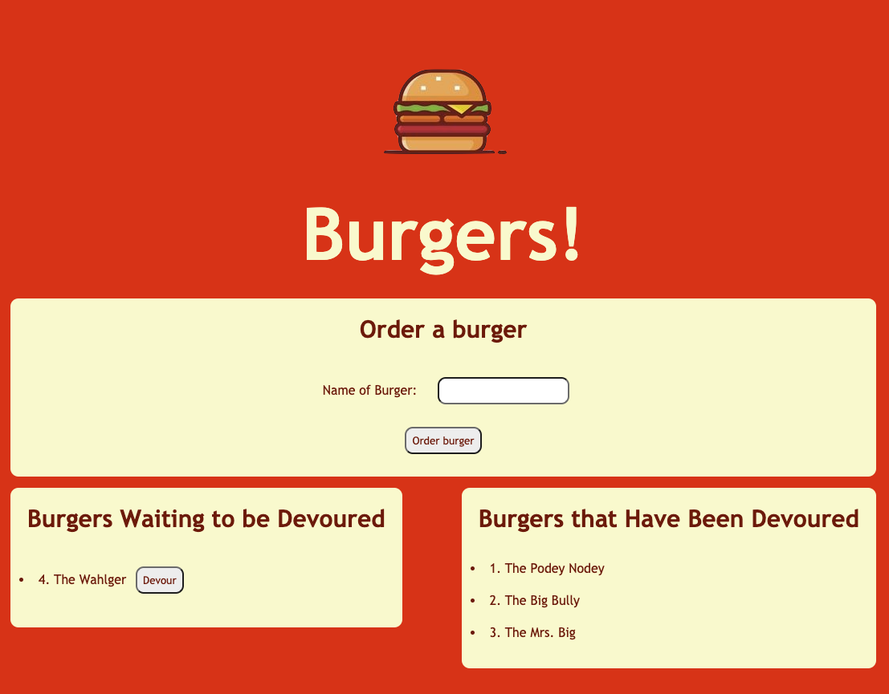

# Burger Logger
This app logs your burgers so you can keep track of all the burgers you've ordered and devoured. 
## Table of Contents
* [Description](#Description)
* [Installation Instruction](#Installation-Instructions)
* [Usage Information](#Usage-Information)
* [Contributions](#Contributions)
* [Testing](#Testing)
* [Questions?](#Questions?)
## Description
This application uses express, handlebars, and mysql to allow users to create and devour burgers!

## Installation Instructions
This project is deployed on Heroku, so following this link: https://secure-coast-61532.herokuapp.com/ will lead you to the deployed app. You could also run locally by downloading the files, running an "npm i" in your terminal/gitbash, and then running "node server.js" in your terminal.
## Usage Information
Created burgers are appended to the left-side column of the page, and each burger has a devour button. Created burgers will be added to the databse. Once devoured, the burger will be appended to the right-side devour column of the page, so you can see all of the burgers that you have devoured.
## Contributions
Elijah Flanders worked alongside me to create and deploy this app
## Testing
N/A
## Questions?
Contact the author for further inquiries! 
Github link: (https://github.com/kyliemegan24) 
Email: kyliemegan24@gmail.com